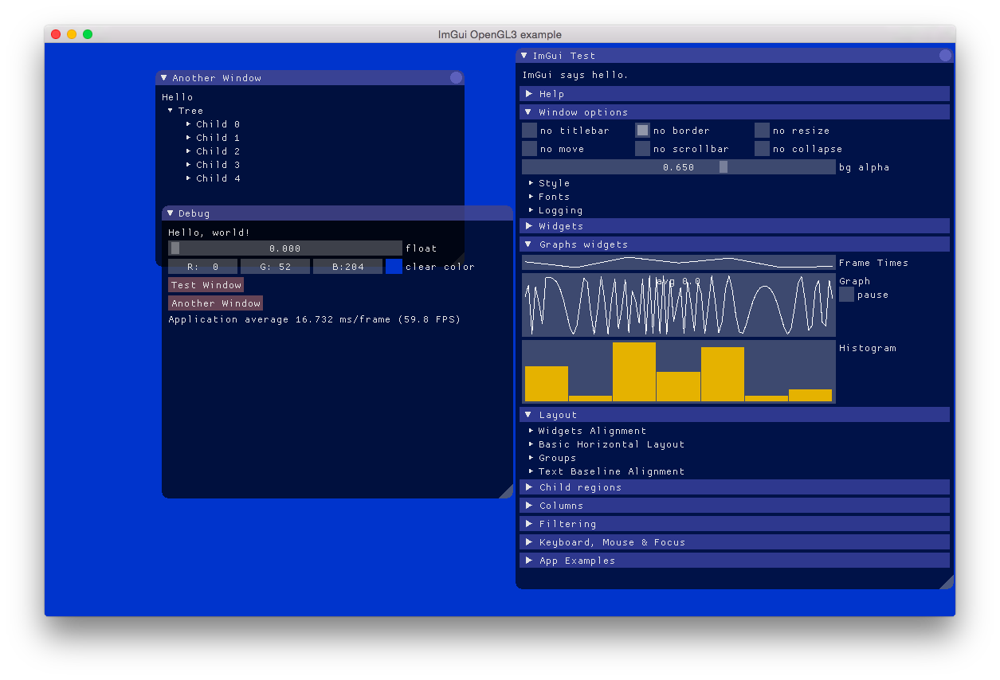

# cimgui 

This is a thin c-api wrapper programmatically generated for the excellent C++ intermediate gui [imgui](https://github.com/ocornut/imgui).
All functions are programmatically wrapped except contructors, destructors and ImVector.(Unless someone find a use case for them)
Generated files are: cimgui.cpp, cimgui.h for C compilation. Also for helping in bindings creation, definitions.lua with function definitions information and structs_and_enums.lua.
This library is intended as a intermediate layer to be able to use imgui from other languages that can interface with C (like D - see [D-binding](https://github.com/Extrawurst/DerelictImgui))

Notes:
* currently this wrapper is based on version [1.62WIP of imgui](https://github.com/ocornut/imgui/)
* does not compile with pure C compiler yet (for writing bindings in languages that are able to use C-ABI it is enough though, see D-bindings)

# auto binding generation

* update imgui folder to the version you desire.
* run imgui/generator/generator.bat (or make a .sh version and please PR) with gcc and Lua on your PATH.
* build as shown in https://github.com/sonoro1234/LuaJIT-ImGui/tree/master_auto_implementations/build
* generate binding as done in https://github.com/sonoro1234/LuaJIT-ImGui/blob/master_auto_implementations/lua/build.bat

# usage

* clone
* make using makefile on linux/osx
* use whatever method is in ImGui c++ namespace in the original [imgui.h](https://github.com/ocornut/imgui/blob/master/imgui.h) by prepending `ig`
* methods have the same parameter list and return values (where possible)

# example bindings based on cimgui

* [DerelictImgui](https://github.com/Extrawurst/DerelictImgui)
* [ImGui.NET](https://github.com/mellinoe/ImGui.NET)
* [ImGuiCS](https://github.com/0x0ade/ImGuiCS)
* [imgui-rs](https://github.com/Gekkio/imgui-rs)
* [imgui-pas](https://github.com/dpethes/imgui-pas)
* [odin-dear_imgui](https://github.com/ThisDrunkDane/odin-dear_imgui)
* [LuaJIT-imgui](https://github.com/sonoro1234/LuaJIT-ImGui)
